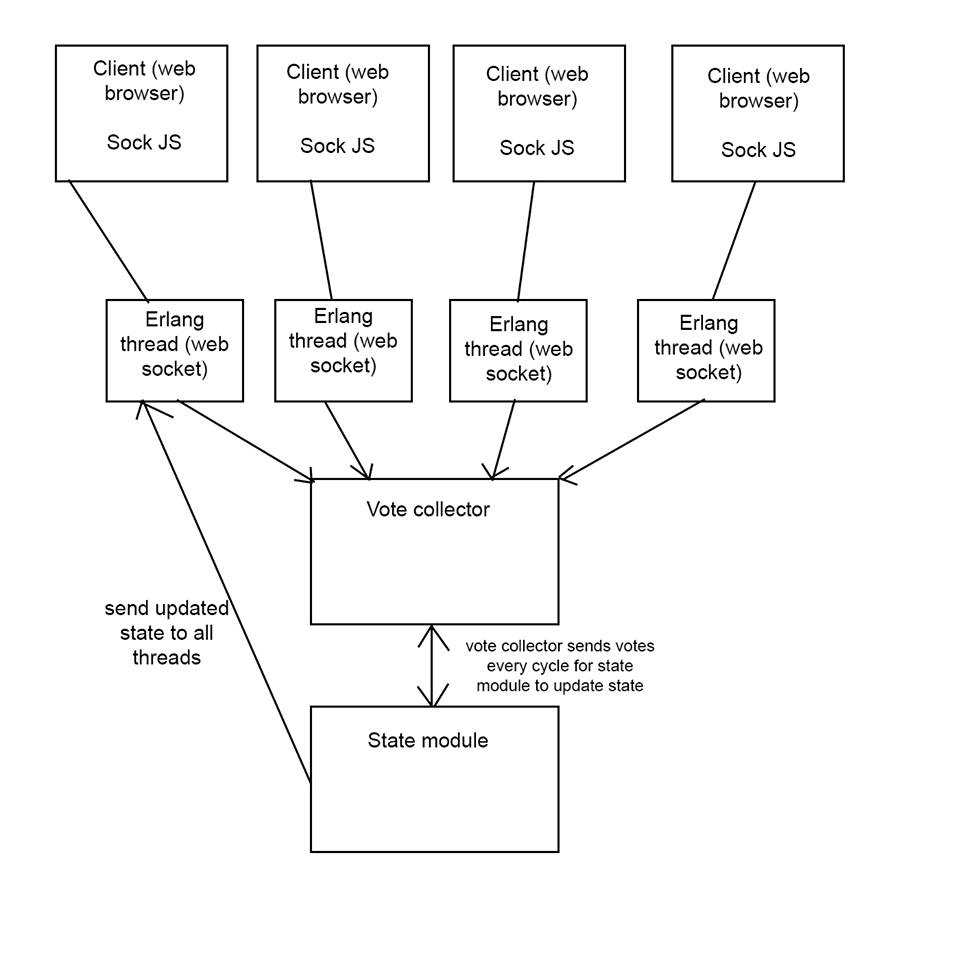

ostracon
========

Team name: ostracon
- Daniel Kim
- Louis Rassaby
- Scott Jacobson
- Jeremy Max Goldman

## Addenda

Though we initially intended to write our library write in Python, we decided 
that in the interests of learning concurrency, we would switch to Erlang. There
are several advantages to Erlang, most notably the lightweight nature of its 
threads and communication between them versus Python's much heavier threads. 

## Summary

We aim to create a Erlang server and corresponding front-end framework that implements distributed voting in real time for an infinitely scalable number of clients. Example use cases would include games (what we intend to implement as our deliverable), distributed music composition, and crowd-sourced intelligence. 

We were inspired by the recent viral craze, "Twitch Plays Pokemon", where millions of users controlled (and eventually won) a complex game through voting via a 
text-based interface. 

We want to take that idea one step further by creating an Erlang server that
can be used for distributed voting through collecting keystrokes and sending 
them realtime to a server that compiles them and selects the winning keystroke
from any number of keystrokes received over a given cycle of time.

The most basic use of our library would be a maze game with two or more 
"players" attempting to reach the end of the maze before the other players. Each 
"player" can be a team of between 1 and n users. The advantage of having 
multiple players vote is that many minds looking at the same maze may be able to
solve the maze faster if they work together. 

Another use case is social psycology studies that aim to learn about teamwork
behavior between people who don't know each other across the internet.

## Deliverables

We aim to break the task of realtime distributed voting into a few components, user-configurable as specified:

####Ostracon Server

#####Vote Collector

1. The vote collector is the main 'loop' of the program. Its helper recieves requests from the client to connect via SockJS, and the collector spawns off a socket "SocketMouth" process to handle that request and maintain a connection with that particular client. 

2. Each SocketMouth process exists for the lifetime of the connection with the client - it begins when the client connects, and it is responsible for fielding votes from the client. Its state represents the last recieved vote, to be queried by the Surveyor threads when they are spawned.
3. At the end of a round of voting, the collector spawns a series of Surveyors that go around to each SocketMouth and send its state to vote collector. The vote collector then aggregates these votes and communicates the result to the State Module

#####State Module

This is a configurable module that is responsible for turning the results of a particular round of voting and its associated histogram into a state that can then be communicated back to the client. This layer of abstraction allows for the voting mechanism to be integrated into full products we have not yet thought of, and attempts to avoid any assumptions about how the votes will be used. It fields messages from the Vote Collector and determines what the SocketMouth will tell the clients.

## Packages

#####Client-To-Server-Side WebSocket Connection:
We are relying on SockJS to cover some of the complications of building an app on WebSocket - the framework provides an abstraction to take care of the details of connecting over WebSocket and other TCP-like protocols. It gets loaded as the sockjs-client framework on the client side. On the server side, we are using the erlang implementation called sockjs-erlang, which will run on a Cowboy server (chosen because it is the preferred environment for sockjs-erlang).

We will build a very thin client-side framework, ostracon-client, over SockJS to abstract away the details of communication between our client and server. This will have a clean interface that consists of four functions: `connect`, `vote`, `requestState`, and `disconnect`.

##Development Plan

With the design in place, we are ready to divi up the work and see how the pieces will fit together. We will, as a group, set up the basic SockJS stack so that we can observe how the pieces fit together and make sure the entire team has a working understanding of this piece of communication. We'll then standardize the object that will be passed over this SockJS connection.

We will also define, write, implement, and test the API for the ostracon-client package we are building.

On the server side, we will determine the contract between the Vote Collector and the State Module, and build an example state module to match the initial game. 

######Breakdown:

Initial JS Game (with hooks for initializing state and taking in final votes) - ***Dan***

Setting up Cowboy server with Erlang-SockJS configured and integration and testing of our ostracon-erlang modules with `SocketMouth` on top of it - ***Jeremy***

Designing and testing `ostracon-client` and `StateModule`, and related APIs - ***Scott***

Designing and testing `ostracon-erlang` modules of `VoteCollector` and `Surveyor` - ***Louis***

## Foreseeable Problems

Timing distributed systems is an incredibly complex problem. Delay on networks 
could cause votes to arrive outside of their expected time block. Depending on 
the application, this may or may not be an important concern.

Also, we have to decide the mechanism by which an application can collect data
when our program is ready to give out that data in real time. 

Overall, the timing of this concurrent system will make it a complex problem.
